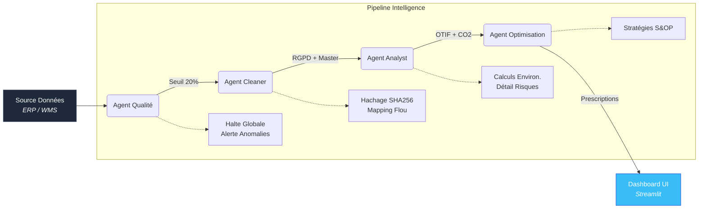

# LogiSphere AI — Command Center & Automation Agents 🚛

> **De l'Excel Brut au Dashboard Exécutif — Zéro intervention manuelle.**
> Une architecture logicielle orientée *Agentic AI* automatisant le nettoyage des données logistiques, l'analyse des KPIs, le suivi de l'Empreinte Carbone Européenne et la génération de plans d'action prescriptifs. Entièrement localisé en français.

---

## Architecture Décisionnelle (Agentic AI)



### 🧠 Nouvel "Optimization Agent" (Couche Prescriptive)
Le système inclut un moteur d'Intelligence Décisionnelle qui lit les KPIs (Dashboard) et prescrit des plans d'actions stratégiques. Ex: *"Transférer 25% du volume de XPO Logistics vers GLS pour améliorer l'OTIF de 5.2%."*

## Fonctionnalités Principales

| Fonctionnalité | Agent Responsable | Détails |
|---------|-------|---------|
| **Validation des Données** | Quality Agent | Halte du pipeline si le taux d'erreur > 20%, protection Data Lake |
| **Anonymisation RGPD** | Cleaner Agent | Hachage SHA-256 des infos personnelles (Noms, Téléphones) |
| **Réconciliation de Données** | Cleaner Agent | Normalisation NLP (Fuzzy) des transporteurs selon la configuration Master |
| **Suivi OTIF** | Analyst Agent | Performance de ponctualité par transporteur (Base = 5 jours) |
| **Émissions de CO₂** | Analyst Agent | Facteurs d'émissions standardisés Europe selon véhicule (kg CO₂ / T.km) |
| **Flags de Risques** | Analyst Agent | Catégorisation automatiques des expéditions: AUCUN, FAIBLE, MOYEN, ÉLEVÉ |
| **Action Plan IA** | Optimization Agent | Génération de recommandations stratégiques de haut-niveau |
| **Dashboard Exécutif** | Streamlit UI | Web App interactive avec Drill-Down des risques, graphiques Plotly et Heatmap |

## Démarrage Rapide

```bash
# 1. Installation des dépendances
pip install -r requirements.txt

# 2. Génération de données fictives & exécution complète du Pipeline Agentique
python pipeline.py --generate

# 3. Lancer le Dashboard interactif
streamlit run dashboard/app.py
```

## Structure du Projet

```
supply-chain-automation-agents/
├── agents/
│   ├── data_quality_agent.py    # Contrôle aux frontières & exception
│   ├── cleaner_agent.py         # RGPD, Fuzzy Matching TheFuzz
│   ├── analyst_agent.py         # KPIs métiers (OTIF, CO2, Risques)
│   └── optimization_agent.py    # IA Prescriptive (Intelligence Opérationnelle)
├── config/
│   └── master_data.json         # Source of Truth (Véhicules, CO2, Transporteurs)
├── dashboard/
│   └── app.py                   # Centre de Commande Streamlit
├── data/
│   ├── raw/                     # Données entrantes (.xlsx / .csv)
│   ├── cleaned/                 # Sorties de l'Agent Cleaner
│   ├── analytics/               # Fichiers analytiques & Plan IA JSON
│   ├── reports/                 # JSON de validation pipeline
│   └── generate_mock_data.py    # Générateur de 500+ lignes synthétiques
├── pipeline.py                  # Chef d'orchestre des agents
```

## Conformité Industrielle (EU)

- **RGPD Act**: Tous les champs PII sont irréversiblement masqués avant analyse.
- **Reporting Environnemental**: Mesure exacte de la logistique verte par types de véhicules européens (`petit_camion`, `fourgonnette`, `gros_camion`, etc).
- **Prêt pour l'Audit (Audit-Ready)**: Traçabilité intégrale, chaque étape générant ses logs de métadonnées de succès ou d'erreurs logiques.

---
*Développé par **Thi Lan Anh NGUYEN** pour les opérations logistiques premium et les environnements de traçabilité 4.0.*
